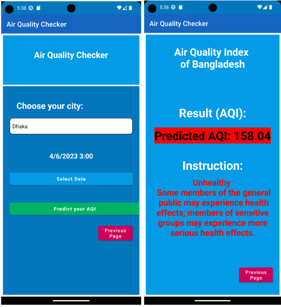

# Air Quality Prediction using Deep Learning

Air quality prediction system using LSTM, GRU, BI-GRU, TCN, and **BGRU-LSTM** models.

## Overview
Developed deep learning models to predict air quality levels for better public health decisions. After experimentation, **BGRU-LSTM** achieved the best performance.

### Key Features
- Models: LSTM, GRU, BI-GRU, TCN, BGRU-LSTM
- Data augmentation & feature engineering
- Deployed on AWS EC2
- Android app (Java) for real-time predictions and health suggestions

## Models
BGRU-LSTM outperformed other models in accuracy and temporal dependency capture.

## Showcase

**[Watch Demo Video](https://youtube.com/shorts/KCxcn48h9XA?feature=share)**

### Screenshots

## Tech Stack
- Deep Learning: TensorFlow/Keras
- Backend: AWS EC2
- Mobile: Android (Java)
